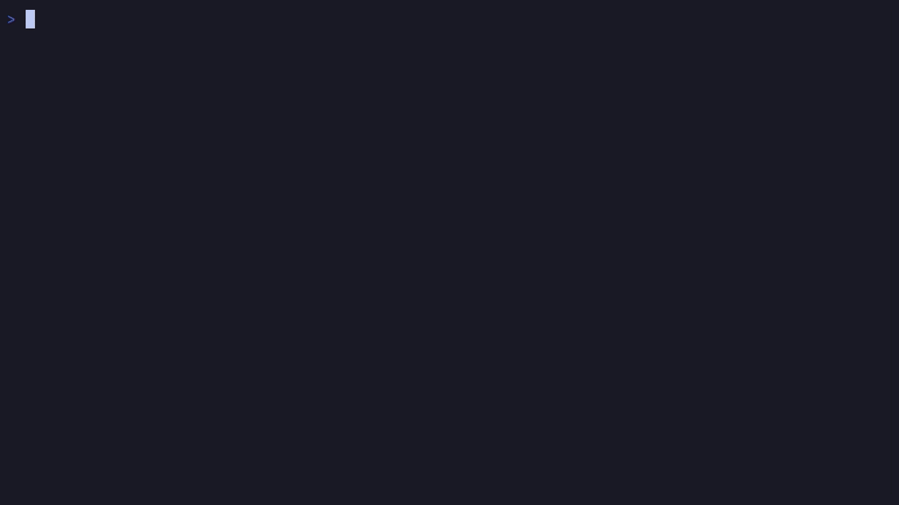

<h1 align="left">nyaa 🐈‍⬛</h1>
<h3>A simple tui for browsing and downloading Anime torrents from nyaa.si.</h3>
<p>
  <a href="https://github.com/Beastwick18/nyaa/releases/latest"></a>
  <a href="https://aur.archlinux.org/packages/nyaa"></a>
  <a href="https://crates.io/crates/nyaa"></a>
</p>

<p align="center">
  
</p>

## ⚡ Installation
### With cargo
```
cargo install nyaa
```

### On Arch Linux ([AUR](https://aur.archlinux.org/packages/nyaa))
```
yay -S nyaa
```

### Windows/Linux Binaries
Binaries for Linux and Windows are available on the [releases](https://github.com/Beastwick18/nyaa/releases/latest) page.

### From Source
To build from source, you must have both `git` and `cargo` installed.
```
git clone https://github.com/Beastwick18/nyaa
cd nyaa
cargo install --path .
```

### Ubuntu/Debian
Download the .deb file from the [latest release](https://github.com/Beastwick18/nyaa/releases/latest) and install with `apt`:
```sh
sudo apt install ./nyaa-VERSION-x86_64.deb
```
or `dpkg`
```sh
sudo dpkg -i ./nyaa-VERSION-x86_64.deb
```

## ⌨️ Keybinds
- Like modal text editors such as Vim, there are several modes. Each have their own keybinds, which can be found out by pressing `F1` or `?` while in that mode. For a list of all modes and their respective keybinds, check [KEYS.md](KEYS.md).

## Proxies
If `nyaa.si` is not accessible in your region, try one of the [proxies](https://nyaatorrents.info/#proxy). Once you find one that works, replace the value for `base_url` in the default config with the working proxy url. I would recommend `nyaa.land`, as it is very compatible, and usually working. Here's what the config for `nyaa.land` would look like:
```toml
base_url = 'nyaa.land'
```

## ⚙️ Configuration
The default configuration file looks like:
```toml
torrent_client_cmd = 'bash -c "curl {torrent} > ~/torrents/{title}.torrent"'
default_theme = 'Default'
default_category = 'AllCategories'
default_filter = 'NoFilter'
default_sort = 'Date'
default_search = ''
default_source = 'NyaaHtml'
base_url = 'https://nyaa.si'
timeout = 30
```
`torrent_client_cmd` is the command that will be run once `Enter` is pressed on a selected torrent. Typically, this is meant to open a torrent client along with the magnet/torrent link passed along as an argument. There are multiple placeholders you can use to fill in information for the command.
  - `{torrent}` - The link to the torrent file hosted on nyaa.si
  - `{magnet}` - The magnet link associated with the torrent
  - `{title}` - The title of the post on nyaa.si
  - `{file}` - The name of the torrent file hosted on nyaa.si

`default_theme` refers to the theme selected by default when the app is opened. Possible values are `Default`, `Dracula`, `Gruvbox`, or `Catppuccin Macchiato`. Custom themes coming soon!

`default_category` refers to the category selected by default when the app is opened. Possible values are defined in [CATEGORIES.md](./CATEGORIES.md).

`default_filter` refers to the filter selected by default when the app is opened. Possible values are `NoFilter`, `NoRemakes`, `TrustedOnly` or `Batches`.

`default_sort` refers to the sort selected by default when the app is opened. Possible values are `Date`, `Downloads`, `Seeders`, `Leechers`, or `Size`.

`default_search` refers to the search entered once the app is opened.

`default_source` refers to the source selected by default once the app is opened. Possible values are `NyaaHtml` and `NyaaRss`.

`base_url` refers to the url used to make requests. Change this to any nyaa mirror url in the format: `http(s)://nyaa.si` or `nyaa.si`

`timeout` refers to how long the program will wait for a search request before it times out. This value is measured in seconds. You may want to increase this if your request times are usually long.

## 🗺️ Planned Features
- [ ] RPM Release
- [ ] User-defined themes
- [ ] Sources other than nyaa/Custom user-defined sources
- [x] ~~Nyaa proxies/mirrors support~~
- [x] ~~Page navigation~~
- [x] ~~Choice between HTML scraper or RSS feed~~
